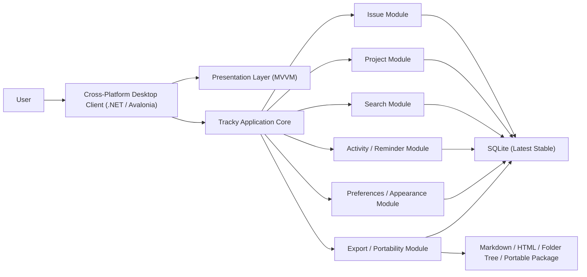

# Tracky Software Design Document

- 문서 버전: Draft v0.5
- 작성일: 2026-04-21
- 대상 프로젝트: Tracky
- 문서 상태: 초기 방향 정렬용 초안

## 1. 문서 목적 및 작성 의도

이 문서는 Tracky를 "GitHub의 UI 레이아웃과 사용 흐름에 익숙한 개인 개발자가 큰 학습 비용 없이 사용할 수 있는 standalone, local-first, cross-platform 이슈-프로젝트 트래커"로 정의하기 위한 설계 초안이다. 현재 단계의 목적은 세부 구현을 확정하는 것이 아니라, 제품의 정체성, 핵심 기능 범위, 우선순위, 아키텍처 방향을 사용자와 함께 맞춰 나갈 수 있는 공통 기준점을 만드는 데 있다.

본 문서는 특히 다음 질문에 답하는 것을 목표로 한다.

1. Tracky는 GitHub와 무엇이 같고, 무엇이 달라야 하는가.
2. "Standalone", "Local-First", "Cross-Platform"이라는 표현이 실제 제품 구조와 배포 방식에서 무엇을 의미하는가.
3. MVP에서 반드시 제공해야 하는 핵심 경험은 무엇인가.
4. 이후 확장을 고려했을 때 어떤 구조로 시작하는 것이 비용 대비 효율적이며, 시각적으로 완성도 높은 UI를 유지하기 쉬운가.

## 2. 제품 비전

Tracky의 최종 목표는 GitHub 이슈와 프로젝트 보드의 익숙한 사용자 경험을 차용하되, 코드 호스팅 플랫폼이나 중앙 서버에 종속되지 않는 개인 개발자용 독립형 이슈-프로젝트 트래커를 만드는 것이다. 사용자는 GitHub를 사용해 본 경험만으로도 Tracky의 이슈 목록, 필터, 상세 페이지, 프로젝트 보드, 메타데이터 사이드바를 직관적으로 이해할 수 있어야 하며, 동시에 Tracky는 GitHub 저장소가 없어도 단독 제품으로 완결된 운영이 가능해야 한다. 또한 Tracky는 단순히 GitHub 스타일의 외형만 차용하는 것이 아니라, GitHub Issues가 제공하는 핵심 도메인 기능과 세부 동작을 가능한 한 높은 수준으로 재현하면서도, 개인 개발자에게 과하지 않은 로컬 우선 구조와 미적으로 정돈된 UI를 제공하는 것을 목표로 한다.

제품 비전은 아래 세 문장으로 요약할 수 있다.

1. 익숙해야 한다. GitHub를 닮은 정보 구조와 인터랙션을 제공한다.
2. 개인적이어야 한다. 개인 개발자의 실제 작업 흐름에 맞는 가벼운 구조와 로컬 우선 경험을 제공한다.
3. 아름답고 빨라야 한다. 오래 보아도 피로하지 않은 UI와 즉각적인 조작 반응을 함께 제공한다.

## 3. 제품 목표와 비목표

### 3.1 목표

Tracky는 다음 목표를 가진다.

1. GitHub Issues 및 GitHub Projects에 익숙한 사용자에게 친숙한 UX 제공
2. Windows, macOS, Linux에서 공통된 핵심 경험을 제공하는 C# 기반 크로스 플랫폼 데스크톱 애플리케이션 구현
3. GitHub Issues의 핵심 기능과 세부 동작을 1차 릴리스에 가능한 한 전면적으로 포함
4. 저장소나 팀 인프라 없이도 개인 개발자가 바로 사용할 수 있는 독립형 이슈 및 프로젝트 관리 기능 제공
5. 이슈 중심 업무 흐름과 프로젝트 중심 업무 흐름을 모두 지원
6. 빠른 검색, 필터링, 메타데이터 편집이 가능한 생산성 중심 UI 제공
7. 미적이면서도 정보 밀도가 높은 깔끔한 UI 제공
8. 필수 백엔드나 클라우드 계정 없이 동작하는 local-first 제품 구조 확보

### 3.2 비목표

초기 버전에서 다음 항목은 핵심 범위에 포함하지 않는다.

1. Git 저장소 호스팅 기능 자체 제공
2. CI/CD, 패키지 레지스트리, 코드 리뷰 도구 등 GitHub 전체 플랫폼 복제
3. 다중 사용자 실시간 협업, 조직 관리, 엔터프라이즈 권한 체계의 우선 구현
4. 핵심 사용을 위해 반드시 필요한 클라우드 백엔드 또는 중앙 서버 전제
5. 지나치게 복잡한 자동화 엔진 또는 노코드 워크플로 빌더 우선 구현

즉, Tracky는 GitHub의 전체 대체재가 아니라 "GitHub Issue/Project 경험을 개인 개발자용 독립 실행형 제품으로 재해석한 도구"를 목표로 한다.

## 4. 핵심 가정

현재 문서는 아래 가정을 바탕으로 작성한다.

1. Tracky의 1차 제품 형태는 C# 기반 크로스 플랫폼 데스크톱 애플리케이션이며, Windows, macOS, Linux에서 공통된 핵심 경험을 제공하는 것을 전제로 한다.
2. 사용자는 개인 개발자, 인디 해커, 프리랜서, 또는 개인 중심으로 프로젝트를 운영하는 소규모 창작자를 주요 타깃으로 한다.
3. 제품의 가장 중요한 차별점은 새로운 업무 방법론을 강요하는 것이 아니라, GitHub 스타일의 익숙한 흐름과 GitHub Issues 수준의 세부 기능을 로컬 우선 구조와 함께 제공하는 데 있다.
4. 초기 UX 우선순위는 모바일보다 데스크톱 경험에 두며, 고밀도 목록, 빠른 메타데이터 편집, 키보드 중심 조작, 정돈된 시각적 완성도를 핵심 사용성으로 본다.
5. 초기 버전은 단일 크로스 플랫폼 클라이언트 내부의 모듈형 애플리케이션 코어와 SQLite 저장 구조로 시작하며, 로컬 우선 단일 사용자 모델을 1차 릴리스의 기본 전제로 확정한다.
6. 1차 릴리스는 일반적인 최소 기능 제품보다 넓은 범위를 가지며, GitHub Issues에서 사용자가 기대하는 세부 기능들을 가능한 한 폭넓게 포함하는 방향으로 설계한다.

이 가정들은 이후 논의를 통해 변경될 수 있다.

## 5. 타깃 사용자와 주요 사용 시나리오

### 5.1 타깃 사용자

Tracky의 주요 사용자는 다음과 같다.

1. GitHub 이슈 사용 경험은 있지만 저장소와 분리된 프로젝트 관리 도구가 필요한 개인 개발자
2. 사이드 프로젝트, 개인 제품, 오픈소스 계획을 한 곳에서 추적하고 싶은 인디 개발자
3. 클라이언트 작업과 개인 로드맵을 Jira보다 가볍게 관리하고 싶은 프리랜서 개발자
4. GitHub의 개념은 익숙하지만 더 정돈된 개인용 계획 도구가 필요한 사용자

### 5.2 대표 시나리오

대표 사용 시나리오는 다음과 같다.

1. 사용자는 이슈 목록에서 상태, 라벨, 담당자, 마일스톤, 우선순위로 빠르게 필터링한다.
2. 사용자는 특정 이슈 상세 화면에서 대화형 타임라인을 보고 코멘트와 상태 변경 이력을 함께 확인한다.
3. 사용자는 프로젝트 보드에서 To do, In progress, Done 흐름으로 카드를 이동한다.
4. 사용자는 프로젝트 테이블, 캘린더, 타임라인 뷰에서 due date와 진행 흐름을 함께 확인한다.
5. 사용자는 GitHub에 익숙한 방식으로 검색창에 `is:open assignee:me label:bug` 형태의 쿼리를 입력해 목록을 좁힌다.
6. 사용자는 앱을 열었을 때 All Issues 중심 홈 화면에서 전체 우선순위, overdue 이슈, 예정된 due date를 한눈에 확인한다.
7. 사용자는 작업 도중 떠오른 아이디어나 버그를 빠르게 캡처하고, 나중에 프로젝트와 연결해 정리한다.
8. 사용자는 현재 필터링된 이슈 목록만 내보낼지, 전체 워크스페이스를 폴더 트리 구조로 내보낼지, 본문을 Markdown으로 내보낼지 HTML로 내보낼지를 세부 옵션으로 선택한다.

## 6. 제품 원칙

Tracky는 아래 원칙을 따른다.

### 6.1 Familiar First

GitHub와 유사한 정보 구조와 인터랙션 패턴을 우선 채택한다. 다만 단순 복제가 아니라, GitHub 사용자에게 즉시 이해되는 경험을 제공하는 것이 목적이다.

### 6.2 Issue-Centric but Project-Aware

이슈는 제품의 기본 단위이지만, 프로젝트 보드와 프로젝트 테이블이 이슈 위에 자연스럽게 얹혀야 한다. 사용자는 이슈 생성 후 별도 복제 없이 프로젝트에 연결해 관리할 수 있어야 한다.

### 6.3 Fast Operations

이슈 검색, 필터 변경, 상태 수정, 담당자 변경 같은 고빈도 작업은 최소 클릭 수로 가능해야 한다.

### 6.4 Local-First Standalone

Tracky는 특정 코드 호스팅 플랫폼, 중앙 서버, 클라우드 계정 없이도 데이터 저장과 프로젝트 운영이 가능한 독립 제품이어야 한다. 사용자는 설치 직후 바로 로컬에서 자신의 작업을 관리할 수 있어야 하며, 오프라인 상태에서도 핵심 흐름이 유지되어야 한다.

### 6.5 Refined Visual Density

Tracky는 생산성 도구이면서 동시에 오래 사용해도 피로하지 않은 인터페이스여야 한다. 미적으로 정돈된 고밀도 UI를 목표로 하며, 정돈된 타이포그래피, 절제된 색 사용, 명확한 시각적 위계, 충분한 여백, 고밀도 정보 표현이 함께 성립해야 한다.

### 6.6 Gradual Complexity

처음부터 복잡한 엔터프라이즈 기능을 전부 넣기보다, 단순한 구조 위에 커스텀 필드, 자동화, 외부 연동, 선택형 동기화 기능을 점진적으로 쌓을 수 있어야 한다.

## 7. MVP 범위 정의

Tracky의 MVP는 단순한 기능 실험판이 아니라, 개인 개발자가 GitHub Issues 대체재에 가깝게 사용할 수 있는 1차 완결 릴리스를 의미한다. 따라서 MVP에서는 사용자가 "별도 서버 없이도 자신의 작업과 프로젝트를 실제로 운영할 수 있다"고 느낄 수 있어야 하며, GitHub Issues의 세부 기능도 가능한 한 넓게 포함해야 한다.

### 7.1 MVP 포함 범위

1. 로컬 워크스페이스 생성 및 기본 설정
2. 프로젝트 생성 및 관리
3. 이슈 생성, 조회, 수정, 상태 변경, 댓글 작성
4. 다중 라벨, 기본 담당자 모델, 마일스톤, 이슈 타입, 우선순위, due date 등 GitHub Issue 핵심 메타데이터 관리
5. `state`와 `state_reason`을 분리한 이슈 상태 모델 지원
6. 닫힘 사유(`completed`, `not_planned`, `duplicate`) 및 재오픈 흐름 지원
7. 체크리스트, 참조 링크, 코드 블록, 첨부를 포함한 이슈 본문 및 댓글 기능
8. GitHub Issues에서 기대되는 세부 메타데이터 편집, 상태 전이, 타임라인 이벤트, 저장된 뷰, 검색 UX를 1차 릴리스 범위에 가능한 한 폭넓게 포함
9. All Issues 중심 홈 화면과 고급 필터링, 저장된 뷰
10. 이슈 상세 화면의 대화형 타임라인
11. 프로젝트 보드 뷰
12. 프로젝트 테이블 뷰
13. 프로젝트 캘린더 뷰
14. 프로젝트 타임라인 뷰
15. 활동 로그 또는 변경 이력
16. 로컬 리마인더와 due date 경험의 완전한 MVP 포함
17. DB 파일 복사 기반의 단순 동기화와 세부 옵션 기반의 공유/내보내기 기능
18. Windows, macOS, Linux 대상 크로스 플랫폼 기본 지원과 테마/환경설정 시스템

### 7.2 MVP 제외 범위

1. 다중 사용자 실시간 협업 및 중앙 서버 기반 공유 편집
2. GitHub 가져오기 및 GitHub 동기화 양방향 연동
3. 고급 간트 차트, 리소스 관리, 엔터프라이즈급 계획 기능
4. 고급 자동화 규칙 엔진
5. 문서 위키 기능
6. 실시간 채팅 기능
7. 파일 버전 관리

## 8. 기능 요구사항

### 8.1 이슈 관리

Tracky는 다음 이슈 관리 기능을 제공해야 한다.

1. 이슈 제목, 설명, 상태, 상태 사유, 라벨, 담당자, 우선순위, 마일스톤, 이슈 타입, due date, 프로젝트 연결 정보 관리
2. 이슈 상태 모델은 `state`와 `state_reason`을 분리해 관리하며, 닫힘 시 `completed`, `not_planned`, `duplicate` 같은 세부 사유를 지원해야 한다.
3. 이슈 생성 및 수정 시 Markdown 기반 본문 작성 기능, 체크리스트, 코드 블록, 첨부, 참조 링크를 지원해야 하며, 렌더링 및 내보내기 단계에서는 HTML 변환도 지원할 수 있어야 한다.
4. 댓글, 상태 변경, 메타데이터 변경, 제목 변경, 라벨/담당자 변경, 마일스톤 변경, 프로젝트 연결 변경 이력을 포함한 타임라인을 제공해야 한다.
5. 다중 라벨, 이슈 간 링크, 중복 표시, 연관 이슈, 하위 작업 또는 서브이슈 개념을 지원할 수 있어야 하며, 담당자 모델은 초기에는 단순하더라도 이후 확장 가능한 구조를 가져야 한다.
6. 저장된 검색, 핀 고정, 템플릿, 빠른 캡처 같은 개인 생산성 기능을 수용할 수 있는 구조를 가져야 한다.
7. 향후 알림, 외부 연동, 선택형 공유 기능을 추가할 수 있는 확장 가능 구조를 확보해야 한다.

### 8.2 프로젝트 관리

Tracky는 프로젝트를 이슈 묶음이 아니라 운영 단위로 취급해야 한다.

1. 프로젝트는 보드 뷰, 테이블 뷰, 캘린더 뷰, 타임라인 뷰를 기본 제공한다.
2. 프로젝트는 커스텀 필드를 가질 수 있다.
3. 하나의 이슈는 여러 프로젝트에 연결될 수 있는 구조를 기본 고려한다.
4. 프로젝트는 필터 저장, 뷰 저장, 정렬 기준 저장을 지원해야 한다.
5. 프로젝트 뷰들은 같은 이슈 데이터를 공유해야 하며, due date와 상태 변화가 보드, 테이블, 캘린더, 타임라인에 일관되게 반영되어야 한다.

### 8.3 검색과 필터

검색과 필터는 GitHub UX를 닮은 핵심 가치다.

1. 자유 텍스트 검색과 구조화 필터를 결합한다.
2. `is:`, `label:`, `assignee:`, `project:`, `milestone:`, `reason:`, `type:` 같은 연산자 기반 검색 문법을 지원한다.
3. 자주 쓰는 필터 조합을 저장된 뷰로 관리할 수 있어야 한다.

### 8.4 개인 생산성 및 일정 관리 기능

1. 댓글과 노트 형태의 기록 작성
2. 활동 이력 확인
3. 담당자 또는 책임 슬롯 지정
4. due date를 1급 메타데이터로 취급하고 목록, 상세, 캘린더, 타임라인에서 일관되게 노출해야 한다.
5. 로컬 알림 및 리마인더 기능은 확장 가능 구조 수준이 아니라 MVP에서 완전한 사용자 경험으로 제공해야 한다.
6. 사용자는 예정된 일정, 오늘 마감, overdue 상태를 All Issues 홈 화면과 프로젝트 뷰에서 빠르게 확인할 수 있어야 한다.

### 8.5 동기화 및 공유/내보내기

1. 가장 단순한 동기화 방식은 워크스페이스 DB 파일을 다른 장비에 복사하거나 덮어쓰는 것만으로 성립해야 한다.
2. 이를 위해 워크스페이스 핵심 데이터와 첨부 파일은 기본적으로 단일 DB 파일만으로 이동 가능한 형태를 우선 고려해야 한다.
3. 공유/내보내기 기능은 단순 내보내기 버튼이 아니라, 내보낼 범위와 형식을 세부적으로 선택할 수 있는 구조여야 한다.
4. 사용자는 이슈 리스트만 내보낼지, 특정 프로젝트만 내보낼지, 전체 워크스페이스를 파일 트리 구조로 내보낼지를 선택할 수 있어야 한다.
5. 사용자는 이슈 본문과 댓글 본문의 출력 형식을 Markdown 또는 HTML 중에서 선택할 수 있어야 한다.
6. 사용자는 첨부 파일 포함 여부, 활동 로그 포함 여부, 닫힌 이슈 포함 여부, 현재 필터 결과만 포함할지 여부 같은 옵션을 세부적으로 조합할 수 있어야 한다.
7. 자주 사용하는 내보내기 구성을 preset 형태로 저장할 수 있는 구조를 고려해야 한다.

## 9. 비기능 요구사항

### 9.1 사용성

1. GitHub 경험이 있는 사용자는 별도의 교육 없이 주요 기능을 사용할 수 있어야 한다.
2. 핵심 화면은 데스크톱 애플리케이션 기준으로 설계하며, 고밀도 데이터 표시와 키보드 탐색을 자연스럽게 지원해야 한다.
3. 키보드 중심 작업을 고려한 인터랙션을 지원해야 한다.
4. UI는 미적이고 깔끔한 인상을 주면서도 정보 밀도와 조작 속도를 해치지 않아야 한다.

### 9.2 성능

1. 이슈 목록 초기 로딩은 일반적인 프로젝트 규모에서 빠르게 완료되어야 한다.
2. 필터 변경 시 목록 갱신은 체감상 즉각적으로 반응해야 한다.
3. 대량 이슈 목록에서도 페이징 또는 가상 스크롤 구조를 고려해야 한다.

### 9.3 확장성

1. MVP는 모놀리식 구조로 시작하되, 검색, 알림, 파일 첨부 같은 기능은 분리 가능한 경계를 가져야 한다.
2. 엔티티 구조는 커스텀 필드, 자동화, 외부 연동을 나중에 추가할 수 있도록 설계해야 한다.

### 9.4 보안

1. 워크스페이스 단위 데이터 격리
2. 로컬 데이터 파일과 설정 정보는 운영체제 사용자 권한 및 안전한 저장 경로를 활용해 보호해야 한다.
3. 감사 로그 또는 변경 이력 확장 가능 구조를 가져야 한다.
4. 향후 외부 연동이나 동기화가 추가될 경우 민감 정보는 안전한 저장 메커니즘을 사용해야 한다.

### 9.5 크로스 플랫폼

1. Windows, macOS, Linux에서 핵심 사용자 흐름이 동일하게 동작해야 한다.
2. 파일 경로, 단축키, 창 동작, 시스템 테마 대응 같은 플랫폼 차이는 추상화 계층으로 흡수해야 한다.
3. 패키징, 데이터 저장 위치, 자동 업데이트 전략은 플랫폼별 차이를 고려해 명시적으로 설계해야 한다.

### 9.6 데이터 이식성 및 공유

1. 단일 워크스페이스는 DB 파일 복사만으로 장비 간 이동과 기본 동기화가 가능해야 한다.
2. 공유/내보내기 결과물은 사용자가 선택한 포맷과 범위를 일관되게 재현해야 한다.
3. 첨부 파일, 본문 포맷, 활동 로그, 메타데이터는 내보내기 옵션에 따라 예측 가능한 방식으로 포함되거나 제외되어야 한다.

## 10. UX 및 정보 구조 설계

Tracky의 UX는 GitHub와 유사한 화면 배치를 참고하되, 개인 개발자에게 더 정돈되고 미적으로 깔끔한 작업 공간을 제공하는 방향으로 설계한다.

### 10.1 전역 레이아웃

전역 레이아웃은 다음과 같이 구성한다.

1. 상단 글로벌 헤더: 워크스페이스 전환, 전역 검색, 빠른 생성, 커맨드 팔레트, 설정/테마 메뉴
2. 좌측 내비게이션: All Issues, Projects, Labels, Milestones, Saved Views, Reports
3. 메인 콘텐츠 영역: 리스트, 보드, 테이블, 상세 화면
4. 우측 컨텍스트 사이드바: 선택 항목의 메타데이터 또는 보조 액션
5. 시각 시스템: 절제된 중성 계열 색상, 명확한 타이포그래피 위계, 얇고 정돈된 구분선, 과하지 않은 애니메이션을 기본 방향으로 삼는다.

### 10.2 All Issues 홈 화면 및 이슈 목록

이슈 목록 화면은 GitHub Issues를 닮은 경험을 제공해야 한다.

1. 앱 실행 시 기본 진입 화면은 All Issues 중심 홈 화면이어야 한다.
2. 상단에 필터 바와 검색창을 둔다.
3. 상태 탭, 저장된 뷰, 정렬 드롭다운, 새 이슈 버튼을 배치한다.
4. 목록의 각 행에는 제목, 상태, 라벨, 담당자, due date, 댓글 수, 업데이트 시간, 프로젝트 정보를 표시한다.
5. 빠른 메타데이터 편집을 위한 인라인 액션을 지원한다.
6. overdue 이슈, 오늘 마감 이슈, 곧 예정된 항목을 빠르게 식별할 수 있는 시각적 표시를 제공한다.

### 10.3 이슈 상세 화면

이슈 상세 화면은 GitHub Issue detail의 구조를 기반으로 한다.

1. 상단에는 제목, 번호, 상태 배지를 배치한다.
2. 본문 영역에는 설명과 댓글, 변경 이력을 시간 순 타임라인으로 배치한다.
3. 우측 사이드바에는 담당자, 라벨, 프로젝트, 마일스톤, 우선순위, 연결 이슈 정보를 제공한다.
4. 사용자 행동은 "읽기", "기록", "메타데이터 수정"이 같은 화면에서 자연스럽게 이어져야 한다.

### 10.4 프로젝트 화면

프로젝트 화면은 GitHub Projects와 칸반 도구의 장점을 결합한다.

1. 같은 데이터를 보드 뷰와 테이블 뷰로 전환해 볼 수 있어야 한다.
2. 같은 데이터를 캘린더 뷰와 타임라인 뷰로도 전환해 볼 수 있어야 한다.
3. 프로젝트별 저장 뷰를 제공한다.
4. 컬럼 이동, 정렬, 필터, 그룹핑이 가능해야 한다.
5. 커스텀 필드와 due date를 프로젝트 운영의 핵심 축으로 사용한다.

## 11. 핵심 화면 목록

초기 제품은 아래 화면들을 기본 범위로 정의한다.

1. 초기 설정 및 첫 워크스페이스 생성 화면
2. All Issues 중심 홈 화면 및 이슈 목록
3. 이슈 상세
4. 프로젝트 목록
5. 프로젝트 상세 보드 뷰
6. 프로젝트 상세 테이블 뷰
7. 프로젝트 상세 캘린더 뷰
8. 프로젝트 상세 타임라인 뷰
9. 라벨 관리
10. 마일스톤 관리
11. 공유/내보내기 설정 화면
12. 사용자 설정 및 화면 테마 관리

## 12. 도메인 모델

초기 도메인 모델의 핵심 엔티티는 다음과 같다.

| 엔티티 | 설명 |
| --- | --- |
| LocalProfile | Tracky의 로컬 사용자 환경과 개인 설정 |
| Workspace | 프로젝트와 공통 설정을 묶는 로컬 작업 영역 |
| Project | 업무 단위 프로젝트 |
| Issue | 작업 추적의 기본 단위 |
| IssueType | 버그, 기능 요청, 작업 등 이슈 분류 |
| Comment | 이슈 대화 및 기록 |
| Label | 분류용 태그 |
| Milestone | 일정 또는 목표 단위 |
| IssueRelation | 중복, 연관, 차단, 하위 작업 등의 관계 |
| SavedView | 저장된 검색 및 필터 뷰 |
| CustomField | 프로젝트 맞춤 필드 정의 |
| ProjectItem | 이슈와 프로젝트의 연결 관계 |
| ActivityEvent | 상태 변경, 댓글 작성 등 이력 이벤트 |
| Reminder | 로컬 알림 또는 리마인더 |
| Attachment | 파일 첨부 메타데이터 |
| ExportPreset | 선택형 공유/내보내기 규칙과 포맷 설정 |

### 12.1 관계 개요

1. 하나의 LocalProfile은 하나 이상의 Workspace를 가질 수 있다.
2. 하나의 Workspace는 여러 Project와 Issue를 가진다.
3. 하나의 Issue는 하나의 Workspace에 속하며, 여러 Label과 여러 Project에 연결될 수 있다.
4. 하나의 Issue는 하나 이상의 IssueRelation을 통해 다른 Issue와 연결될 수 있다.
5. 하나의 Project는 여러 ProjectItem을 가지며, ProjectItem은 실제 Issue와 연결된다.
6. ActivityEvent는 Issue 또는 Project에 대한 변경 이력을 기록한다.
7. Reminder는 특정 Issue 또는 Project에 연결되거나 독립적으로 존재할 수 있다.

## 13. 데이터 모델 초안

초기 테이블 구성은 아래와 같은 방향을 제안한다.

### 13.1 핵심 테이블

1. `profiles`
2. `workspaces`
3. `projects`
4. `issues`
5. `issue_types`
6. `issue_comments`
7. `labels`
8. `issue_labels`
9. `milestones`
10. `issue_relations`
11. `saved_views`
12. `project_items`
13. `custom_fields`
14. `custom_field_values`
15. `activity_events`
16. `reminders`
17. `attachments`
18. `export_presets`

### 13.2 설계 포인트

1. 이슈 자체의 공통 필드와 프로젝트별 커스텀 필드는 분리한다.
2. 이슈 상태는 단순 문자열 하나가 아니라 `state`와 `state_reason`의 조합으로 표현해 GitHub Issue의 닫힘 사유 모델을 반영한다.
3. due date는 단순 커스텀 필드가 아니라 기본 이슈 메타데이터로 취급해 캘린더, 타임라인, 리마인더 경험의 기반으로 사용한다.
4. 활동 로그는 별도 이벤트 테이블로 분리해 상세 타임라인, 감사 로그, 리마인더 확장의 기반으로 사용한다.
5. 다중 프로젝트 연결, 다중 라벨 연결, 이슈 관계를 고려해 조인 테이블 구조를 명확히 유지한다. 담당자 모델은 초기에는 단순하게 가져가되, 향후 다중 사용자 확장 시 별도 관계 테이블로 옮길 수 있는 경계를 둔다.
6. SQLite를 기본 저장소로 사용할 경우, 데이터 파일은 데스크톱 애플리케이션이 일관되게 관리하도록 설계하고 WAL 모드와 외래 키 제약을 기본 전제로 둔다.
7. 첨부 파일은 DB 파일 복사만으로 동기화가 가능하도록 기본적으로 SQLite 내부 저장 또는 동등한 단일 파일 포터블 구조를 우선 고려한다.
8. 검색은 SQLite FTS5와 적절한 인덱스를 우선 활용하며, 이후 필요 시 별도 인덱스 계층을 붙일 수 있도록 분리한다.
9. 내보내기 preset은 범위, 포맷, 첨부 포함 여부, 활동 로그 포함 여부 같은 세부 옵션을 저장할 수 있어야 한다.

## 14. 권장 시스템 아키텍처

Tracky는 초기 버전에서 "크로스 플랫폼 데스크톱 클라이언트 + 내부 애플리케이션 코어 + 로컬 SQLite" 구조가 가장 현실적이다. 이는 C# 기반 데스크톱 UX를 확보하면서도, 로컬 우선 저장 구조를 유지하고, 별도 백엔드 없이 빠르게 제품 경험을 완성할 수 있는 방향이다.

### 14.1 아키텍처 개요

### 14.2 아키텍처 결정 이유

1. GitHub 스타일의 고밀도 UI와 빠른 메타데이터 편집은 데스크톱 애플리케이션에서 높은 반응성과 세밀한 입력 제어를 얻기 좋다.
2. Avalonia 기반 크로스 플랫폼 UI는 하나의 코드베이스로 Windows, macOS, Linux를 함께 지원하기에 적합하다.
3. 별도 백엔드를 기본 전제로 두지 않으면 초기 개발 범위와 운영 복잡도를 줄일 수 있으며, 제품의 핵심인 UX와 도메인 모델에 집중하기 쉽다.
4. 도메인 로직을 내부 애플리케이션 코어에 집중하면 UI와 데이터 저장 사이의 책임을 분리하면서 테스트 가능성을 확보할 수 있다.
5. 첨부 파일을 포함한 워크스페이스를 단일 DB 파일 중심으로 이동 가능하게 만들면 개인 사용자에게 매우 단순한 동기화 경험을 제공할 수 있다.
6. 세부 옵션 기반의 내보내기와 공유 기능은 개인용 도구에서도 높은 실용 가치를 가지므로, 초기 구조에서부터 portability 경계를 명확히 두는 것이 적절하다.

## 15. 기술 스택 및 확정 방향

현재 구현체가 없는 상태이지만, 아래 방향 중 Avalonia 채택, 로컬 우선 단일 사용자 모델, GitHub Issues 세부 기능의 1차 릴리스 포함, 미적으로 정돈된 고밀도 UI 지향은 현재 확정 사항으로 본다. 그 외 세부 구현 선택지는 이후 설계 과정에서 구체화한다.

### 15.1 프론트엔드

1. C# + .NET 10.0을 기본 플랫폼으로 채택한다.
2. Windows, macOS, Linux를 함께 지원하기 위해 Avalonia UI를 1차 UI 프레임워크로 사용한다.
3. UI 아키텍처는 MVVM 패턴을 채택해 화면 상태, 명령, 도메인 로직의 책임을 명확히 분리한다.
4. 디자인 시스템은 GitHub 스타일의 정보 밀도와 메타데이터 편집 UX를 재현하면서도, 미적으로 정돈된 고밀도 UI를 실현할 수 있도록 절제된 색상, 선명한 타이포그래피, 일관된 간격, 은은한 모션을 갖춘 자체 시각 체계로 구성한다.
5. 대량 이슈 목록과 프로젝트 테이블을 고려해 가상화, 키보드 단축키, 커맨드 팔레트, 고속 필터링을 1급 요구사항으로 둔다.

### 15.2 애플리케이션 코어 및 서비스 계층

1. 별도 원격 백엔드 대신, 데스크톱 앱 내부에 독립된 애플리케이션 코어 계층을 둔다.
2. 애플리케이션 코어는 모듈형 모놀리식 구조로 시작하며, Workspace, Issue, Project, Search, Activity, Reminder, Attachment, Preferences, Export/Portability 모듈을 분리한다.
3. UI는 네트워크 API가 아니라 명시적인 Command/Query 인터페이스를 통해 애플리케이션 코어를 사용한다.
4. GitHub Issue의 세부 동작을 안정적으로 재현하기 위해 상태 전이, 활동 로그 생성, 검색 쿼리 해석, 리마인더 규칙 같은 도메인 로직을 애플리케이션 코어에 집중시킨다.
5. 동기화는 네트워크 동기화보다 우선적으로 DB 파일 복사 기반 portability를 지원하며, 공유는 세부 옵션 기반의 내보내기 시스템으로 제공한다.

### 15.3 데이터 저장소

1. SQLite 최신 안정 버전을 주 데이터베이스로 사용해 이슈, 프로젝트, 활동 로그, 관계형 메타데이터를 관리한다.
2. SQLite는 WAL 모드, 외래 키 제약 활성화, 마이그레이션 버전 관리, 주기적 백업을 기본 운영 원칙으로 삼는다.
3. SQLite 데이터 파일은 Tracky 데스크톱 앱이 단일 권한 주체로 관리하며, 직접 파일 편집을 전제로 하지 않는다.
4. 첨부 파일은 DB 파일 복사만으로 워크스페이스 이동과 동기화가 가능하도록 기본적으로 SQLite 내부 저장 또는 단일 파일 포터블 구조를 우선 채택한다.
5. 초기 검색은 SQLite FTS5와 적절한 인덱스를 우선 활용하고, 데이터 규모가 커질 경우 별도 검색 인덱스 엔진 연동을 검토한다.
6. 공유/내보내기 시스템은 DB 내부 데이터를 Markdown, HTML, 폴더 트리 구조, 포터블 패키지 형태로 변환할 수 있어야 한다.

### 15.4 배포

1. 데스크톱 클라이언트는 self-contained 배포를 기본으로 하며, Windows는 설치형 패키지 또는 MSIX, macOS는 앱 번들, Linux는 AppImage 또는 배포판 친화 패키지를 우선 검토한다.
2. 기본 배포 전략은 Tracky 앱과 SQLite 데이터 파일을 한 장비에서 함께 운영하는 "로컬 단일 장비 모드"로 둔다.
3. 데이터 파일과 설정 파일은 운영체제별 표준 앱 데이터 경로에 저장하며, 첨부 파일은 기본적으로 워크스페이스 DB 안에 함께 포함되도록 설계한다.
4. SQLite 데이터 파일을 네트워크 공유 드라이브에서 여러 프로세스가 직접 동시에 접근하는 방식은 지원 대상으로 보지 않는다.
5. 백업 및 복구 전략은 SQLite 데이터 파일 하나의 스냅샷, 선택형 내보내기, 가져오기 절차를 중심으로 설계한다.
6. 장비 간 기본 동기화는 사용자가 워크스페이스 DB 파일을 복사하거나 덮어쓰는 방식만으로 수행할 수 있어야 한다.

## 16. 애플리케이션 모듈 설계

Tracky는 아래 모듈로 나누어 설계하는 것이 바람직하다.

### 16.1 Local Profile / Workspace Module

로컬 프로필, 워크스페이스 생성, 기본 설정, 데이터 경로 관리를 담당한다.

### 16.2 Issue Module

이슈 CRUD, 댓글, 상태 변경, 닫힘 사유 관리, 라벨 연결, 담당자 연결, 이슈 타입, due date를 포함한 메타데이터 변경, 이력 기록을 담당한다.

### 16.3 Project Module

프로젝트 생성, 보드/테이블/캘린더/타임라인 뷰, 커스텀 필드, 저장된 뷰, 그룹핑을 담당한다.

### 16.4 Search Module

검색 쿼리 파싱, 필터 처리, 저장된 검색 조건, GitHub 스타일 연산자 기반 쿼리 해석을 담당한다.

### 16.5 Activity / Reminder Module

활동 이벤트 생성, 상세 타임라인, due date 기반 상태 추적, 로컬 리마인더, 향후 알림 기능의 기반을 담당한다.

### 16.6 Attachment Module

이슈 본문 및 댓글에 첨부된 파일 메타데이터와 저장소 연동을 담당한다.

### 16.7 Preferences / Appearance Module

테마, 타이포그래피 스케일, 레이아웃 밀도, 단축키, 사용자 환경설정을 담당한다.

### 16.8 Export / Portability Module

선택형 공유/내보내기, 포맷 변환, preset 저장, DB 파일 기반 portability 규칙을 담당한다.

## 17. 내부 서비스 계약 및 향후 API 방향

초기 버전은 별도 네트워크 API를 기본 전제로 두지 않는다. 대신 데스크톱 UI가 소비하는 내부 Command/Query 계약을 명확히 정의하는 것이 적절하다. 특히 제품 초기에 중요한 것은 도메인 모델 정립과 빠른 반복이므로, UI와 애플리케이션 코어 사이의 인터페이스를 먼저 안정화하는 편이 유지보수 측면에서 유리하다.

예시 계약은 아래와 같다.

1. `GetIssues(query)`
2. `CreateIssue(input)`
3. `GetIssueDetail(issueId)`
4. `UpdateIssue(issueId, patch)`
5. `AddIssueComment(issueId, input)`
6. `GetProjects()`
7. `MoveProjectItem(projectId, itemId, changeSet)`
8. `SearchIssues(query)`
9. `ScheduleReminder(issueId, reminderSpec)`
10. `ExportSelection(exportOptions)`

API 설계 시 고려할 원칙은 다음과 같다.

1. 목록 조회는 필터와 정렬을 일관된 방식으로 제공한다.
2. 이슈 변경은 ActivityEvent 생성과 함께 처리한다.
3. 프로젝트 뷰와 이슈 뷰가 동일한 기본 엔티티를 공유하도록 한다.
4. 향후 외부 API가 필요해질 경우, 내부 계약과 가능한 한 일대일로 대응되도록 설계한다.

## 18. 로컬 보안 및 데이터 보호 모델

초기 보안 모델은 개인용 로컬 애플리케이션에 맞게 단순해야 하지만, 이후 선택형 공유나 동기화 기능을 추가할 수 있도록 확장 가능해야 한다.

### 18.1 기본 접근 모델

1. 기본 사용 모델은 단일 로컬 사용자 전제를 따른다.
2. 여러 로컬 워크스페이스를 운영하더라도 데이터와 설정은 워크스페이스 단위로 분리한다.
3. 향후 협업 공유 기능이 추가될 경우, 역할 기반 권한은 별도 계층으로 도입한다.

### 18.2 보안 요구사항

1. 워크스페이스 간 데이터 혼입을 방지해야 한다.
2. 민감한 로컬 설정이나 향후 외부 연동 자격 증명은 운영체제 수준의 안전한 저장소를 활용할 수 있어야 한다.
3. 변경 이력 기록 기반의 추적 가능성을 확보해야 한다.
4. 백업, 내보내기, 가져오기 과정에서 데이터 무결성을 유지해야 한다.
5. 공유/내보내기 기능은 사용자가 선택한 범위와 포맷만 포함하도록 명시적 옵션 기반으로 동작해야 한다.

## 19. 검색 및 필터 설계 방향

검색은 Tracky의 핵심 경쟁력 중 하나가 되어야 한다. 단순 키워드 검색보다 "빠르게 좁혀가는 작업 경험"이 중요하다.

초기 방향은 다음과 같다.

1. 기본 텍스트 검색과 필터 UI를 함께 제공한다.
2. 내부적으로는 구조화 필터 모델을 유지하고, UI에서는 검색 문자열과 필터 칩 두 방식을 병행한다.
3. 검색 문법은 초기부터 GitHub 스타일 쿼리 문법을 염두에 두고 설계하며, `reason:` 같은 세부 상태 사유 검색도 수용해야 한다.

## 20. 알림 및 활동 로그 설계 방향

Tracky는 댓글과 상태 변경이 모두 기록되는 이슈 중심 도구이므로 활동 로그가 매우 중요하다.

1. 모든 핵심 변경은 ActivityEvent로 기록한다.
2. ActivityEvent는 상세 타임라인, 감사 로그, 리마인더, 향후 알림 시스템의 공통 기반이 된다.
3. 알림은 초기에는 앱 내 리마인더와 due date 기반 배지 중심으로 설계하고, 이후 이메일 또는 외부 메신저 연동은 선택 기능으로 검토한다.

## 21. 테스트 전략

초기 설계 단계부터 테스트 계층을 고려해야 한다.

1. 도메인 로직은 단위 테스트로 검증한다.
2. 애플리케이션 코어와 SQLite 연동은 통합 테스트로 검증한다.
3. 핵심 사용자 흐름은 E2E 테스트로 검증한다.
4. GitHub 스타일 UI는 상호작용 밀도가 높고 시각적 완성도도 중요하므로, 회귀 테스트와 시각적 검증의 가치가 크다.

핵심 E2E 시나리오는 아래와 같다.

1. 이슈 생성 후 목록에 반영되는지 확인
2. 이슈 상세에서 댓글 작성과 상태 변경이 타임라인에 반영되는지 확인
3. 프로젝트 보드에서 카드 이동 시 필드 값이 일관되게 유지되는지 확인
4. 검색 및 필터 조건이 정확히 적용되는지 확인
5. due date와 리마인더가 All Issues, 캘린더, 타임라인에 일관되게 반영되는지 확인
6. 선택형 내보내기에서 Markdown/HTML/폴더 트리 결과가 옵션에 맞게 생성되는지 확인
7. Windows, macOS, Linux에서 핵심 흐름이 동일하게 동작하는지 스모크 테스트로 확인

## 22. 운영 및 관찰 가능성

운영 관점에서는 다음 요소를 고려한다.

1. 애플리케이션 로그
2. 에러 트래킹
3. 성능 모니터링
4. 감사 로그
5. 백업 및 복구 전략

Standalone 제품인 만큼 설치와 운영의 단순성도 제품 경험의 일부로 간주해야 한다.

## 23. 단계별 로드맵 제안

1차 완결 릴리스는 아래 Phase 1부터 Phase 3까지를 포함하는 것을 기본 전제로 한다.

### Phase 1. Foundation

로컬 워크스페이스, 기본 이슈 CRUD, 라벨/담당자/우선순위/due date, 상태 사유 모델, 첨부 파일, All Issues 중심 홈 화면, 크로스 플랫폼 앱 셸과 기본 디자인 시스템을 구현한다.

### Phase 2. Project Management Core

프로젝트 보드, 테이블 뷰, 캘린더 뷰, 타임라인 뷰, 커스텀 필드, 저장된 뷰를 구현한다.

### Phase 3. Personal Productivity and Portability

리마인더, due date 경험 완성, 고급 검색 문법, 활동 로그 개선, 세부 옵션 기반 공유/내보내기, 단축키, 시각적 완성도 향상을 구현한다.

### Phase 4. Integration and Extension

GitHub 가져오기, 외부 알림 연동, 다중 장비 변경 병합이 가능한 고급 동기화, 협업 공유 기능, 자동화 규칙, 리포트 기능을 검토한다.

## 24. 향후 확장 가능 기능

MVP 이후 아래 기능을 확장 후보로 둔다.

1. GitHub Importer
2. Sprint 및 Iteration 관리
3. 반복 작업 템플릿
4. 자동화 규칙
5. Slack 또는 Discord 알림 연동
6. 클라우드 백업 또는 암호화된 원격 저장
7. 다중 장비 변경 병합이 가능한 고급 동기화
8. 중앙 서버 기반 협업 모드

## 25. 현재 시점의 핵심 확정 의사결정

현재 시점에서 아래 네 가지는 핵심 확정 의사결정으로 본다.

1. Avalonia를 1차 UI 프레임워크로 확정한다.
2. 로컬 우선 단일 사용자 모델을 1차 릴리스의 기본 전제로 확정한다.
3. GitHub Issues에서 지원하는 세부 기능들은 1차 릴리스 범위에 가능한 한 전면 포함하는 것을 기본 방침으로 한다.
4. UI 방향은 미적으로 정돈된 고밀도 UI로 확정한다.

현재 사용자 의도에 가장 가까운 시작점은 "Avalonia 기반 크로스 플랫폼 데스크톱 애플리케이션, 로컬 우선 저장 구조, 단일 사용자 중심 모델, GitHub Issues 세부 기능을 1차 릴리스에 가능한 한 전면 반영하는 데이터 모델, 미적으로 정돈된 고밀도 UI"라고 판단한다.

## 26. 추가 확정 사항

현재 사용자와 합의된 추가 확정 사항은 아래와 같다.

1. 홈 화면은 Today 요약보다 All Issues 중심으로 설계한다.
2. 프로젝트 보드 외에 캘린더와 타임라인 뷰를 초기부터 포함한다.
3. GitHub 가져오기 기능은 1차 릴리스 이후로 미룬다.
4. 첨부 파일 기능은 MVP에 포함한다.
5. 로컬 리마인더와 due date 경험은 MVP에서 완전하게 제공한다.
6. 동기화는 워크스페이스 DB 파일을 붙여넣는 것만으로 가능한 단순 portability를 우선한다.
7. 공유/내보내기는 범위, 포맷, 출력 구조를 세밀하게 선택할 수 있는 옵션 중심 구조로 설계한다.

## 27. 결론

Tracky의 설계 핵심은 "GitHub를 닮은 익숙한 레이아웃" 그 자체가 아니라, GitHub 사용자에게 자연스럽고 빠르게 이해되는 작업 흐름과 GitHub Issues의 세부 도메인 기능을 개인 개발자용 standalone 제품 안에서 재구성하는 데 있다. 따라서 이 문서는 화면을 단순 모사하는 방향보다, All Issues 중심 홈 화면, 이슈 상세, 프로젝트 보드/테이블/캘린더/타임라인, 검색 및 필터, 메타데이터 사이드바, 활동 로그, 상태 사유 모델, due date와 리마인더, 첨부 파일, DB 파일 기반 portability, 세밀한 공유/내보내기, 크로스 플랫폼 UX, 정돈된 시각 체계 같은 핵심 경험을 중심으로 제품 구조를 정의했다.

현재 초안은 MVP 범위와 구조적 방향을 정리하는 수준이며, 이후 논의에서는 특히 다음 세 축을 중심으로 문서를 정교화하면 좋다.

1. 정보 구조와 화면 우선순위
2. 도메인 모델과 데이터 구조
3. 크로스 플랫폼 구현 기술과 시각 디자인 시스템
